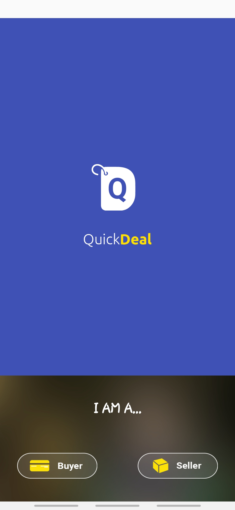

## QuickDeal-SplashScreen

### Description

A splash screen is a graphical control element consisting of a window containing an image, a logo, and the current version of the software. A splash screen usually appears while a game or program is launching.

This is an Android Application which consist of Animated Splash Screen.

`Developed in 2017`

### Demo

`The Icon will move up smoothly and the below user Specific login will appear.`

**[Click here to download the apk](https://drive.google.com/open?id=1KKupcrnBLLU-J7WgripejWbhhvdrKBEQ)**
<a href="https://drive.google.com/open?id=1KKupcrnBLLU-J7WgripejWbhhvdrKBEQ" target="_blank">
	

  		       
	

</a>

### Features

	• Interactive Splash Screen 
	• Zero functionality- Fetch the code and Start your own application with a Animated Spash Screen 
